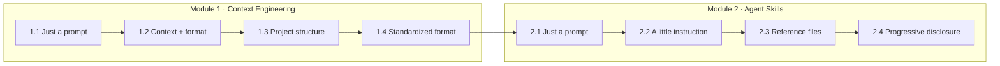

# AI for Testers — Hands-on Learning Path

A half-day, lab-driven workshop for software testers learning to work with AI
agents through **GitHub Copilot CLI** — starting from a bare prompt and ending
with reusable, standardized, token-efficient setups.

Every lab is a **self-contained folder**: `cd` in, start `copilot`, follow the
lab's `README.md`. The example files (specs, `AGENTS.md`, `SKILL.md`,
references) are right there in the folder so you can read them, run against
them, and break them.

The testing scenario is the same throughout — a **coupon discount feature** —
so you can feel the difference each technique makes on the exact same task.

## Who this is for

- Testers / QA engineers with little or no AI-agent experience
- You can read a requirement spec and write test cases — no coding required

## Prerequisites (do before class)

1. Clone this repository
2. Install [GitHub Copilot CLI](https://docs.github.com/en/copilot/how-tos/copilot-cli):
   `npm install -g @github/copilot` — then run `copilot` once and sign in
   (requires a GitHub account with a Copilot subscription or trial)
3. Verify: from the repo root run `copilot` and ask
   `what is this repository about?` — it should describe this workshop.

## The learning path



Both modules follow the same arc on purpose: **start with a naked prompt, watch
it fail in interesting ways, then fix it one layer at a time.** Module 1 fixes
it for *one workspace*; Module 2 packages the fix as a **skill** that loads
itself only when needed.

## Half-day schedule (~3h45m)

| Time | Session | Material |
|---|---|---|
| 00:00–00:15 | Intro: how agents "see" — context windows, tokens, why context is everything | slides / whiteboard |
| 00:15–01:45 | **Module 1: Context Engineering** (4 labs, ~15 min each + discussion) | `labs/01-context-engineering/` |
| 01:45–02:00 | ☕ Break | |
| 02:00–03:30 | **Module 2: Agent Skills & Progressive Disclosure** (4 labs + build-your-own) | `labs/02-agent-skills/` |
| 03:30–03:45 | Wrap-up: what to standardize in *your* team first; further reading | this README |

## How to run every lab (same routine)

```bash
cd labs/<module>/<lab-folder>
copilot            # always a FRESH session — clean context is part of the experiment
# follow the lab's README.md, then /exit before the next lab
```

## Repository map

```
labs/
  01-context-engineering/          Module 1 — prompt → context → structure → standard
    lab-1.1-just-a-prompt/
    lab-1.2-context-and-format/      + prompt-example.md
    lab-1.3-project-structure/       + requirements/ api/ test-cases/
    lab-1.4-standardized-format/     + AGENTS.md + templates/  ← read that AGENTS.md!
  02-agent-skills/                 Module 2 — prompt → SKILL.md → references → progressive disclosure
    lab-2.1-just-a-prompt/           + bug-notes.md
    lab-2.2-a-little-instruction/    + .github/skills/bug-report/SKILL.md
    lab-2.3-reference-files/         + references/ (template, severity guide)
    lab-2.4-progressive-disclosure/  + scripts/ + a decoy reference (JIT proof)
    lab-2.5-install-a-real-skill/    bonus: install test-engineer (project & global level)
sample-project/                  Canonical copy of the coupon spec, API doc, template
docs/
  instructor-notes.md                        Verified test results, per-lab talking
                                             points, cost/timing, run-sheet reminders
  agent-skills-progressive-disclosure.html   Reference guide (Thai) for Module 2 —
                                             open it in a browser
```

Note: `.github/` folders inside Module 2 labs are hidden — `ls -la` to see
them. Labs 1.3/1.4 contain **copies** of `sample-project/`; that duplication is
deliberate so each lab is isolated.

## Further reading

- [agentskills.io](https://agentskills.io/home) — the Agent Skills open standard
- [Adding agent skills for Copilot CLI](https://docs.github.com/en/copilot/how-tos/copilot-cli/customize-copilot/add-skills)
- `docs/agent-skills-progressive-disclosure.html` — Thai-language deep dive on
  progressive disclosure, JIT loading, and per-platform comparison
- [AGENTS.md](https://agents.md) — the cross-tool context-file convention from Lab 1.4

## Extending this course

This repo is designed to grow. Candidate next modules: AI-assisted exploratory
testing, test-data generation, reviewing AI output (trust & verification), and
building an MCP tool for your test-management system. Follow the same pattern:
one folder per module, one self-contained folder per lab, everything runnable
against the coupon scenario.
